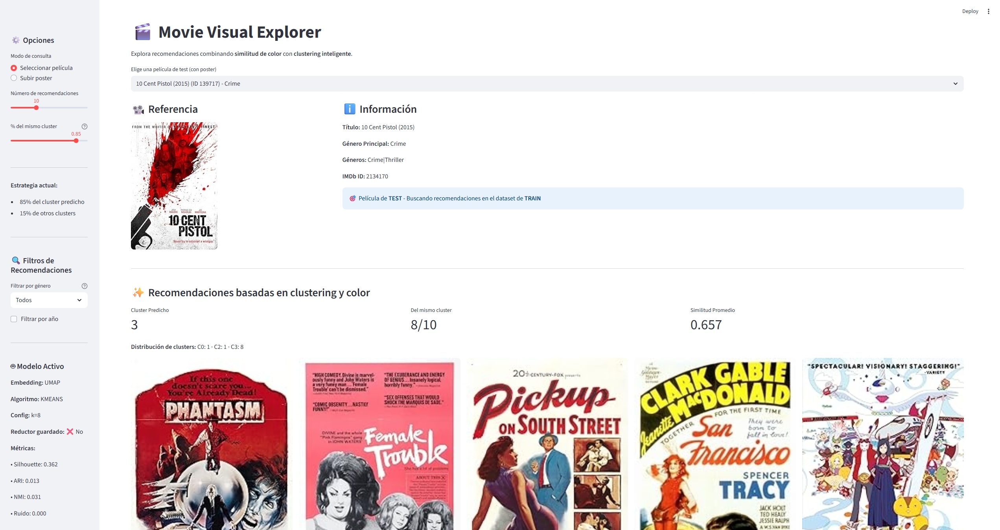
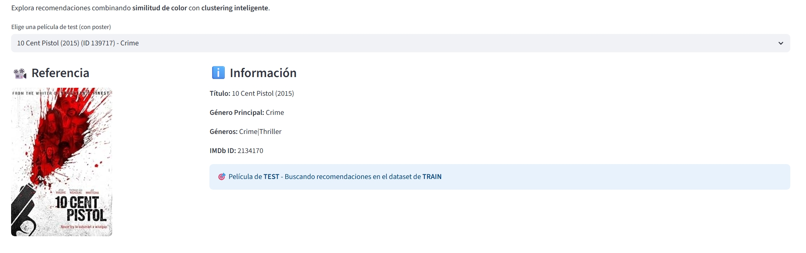
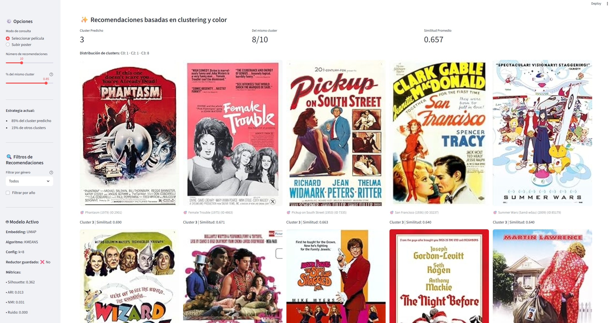
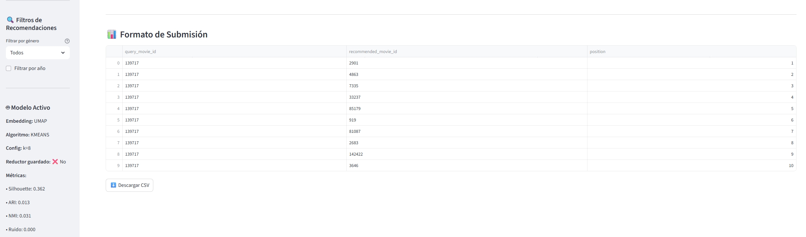

# 🎬 Movie Visual Explorer

**Creador:** Kenyi Reyes

Sistema inteligente de recomendación de películas basado en análisis visual de pósters mediante clustering y similitud de color.

---

## 📋 Descripción del Proyecto

Este proyecto implementa un sistema de recomendación de películas que analiza los pósters utilizando técnicas de visión computacional y aprendizaje no supervisado. A diferencia de los sistemas tradicionales basados en texto, este enfoque se centra en las características visuales de los pósters para encontrar películas similares.

### 🎯 Características Principales

- **Análisis de Color:** Extracción de histogramas de color RGB normalizados
- **Reducción Dimensional:** Implementación de UMAP para embeddings 2D
- **Clustering Inteligente:** Algoritmo K-Means para agrupar películas visualmente similares
- **Búsqueda Híbrida:** Combina similitud coseno y clustering para recomendaciones precisas
- **Filtros Avanzados:** Filtrado por género y rango de años
- **Interfaz Interactiva:** Aplicación web desarrollada con Streamlit

---

## 🤖 Modelo de Machine Learning

### Arquitectura del Sistema

```
Poster de Película
       ↓
Histograma de Color RGB (normalizado)
       ↓
UMAP (Reducción Dimensional)
       ↓
K-Means Clustering
       ↓
Recomendaciones Híbridas
```

### Componentes Técnicos

1. **Extracción de Características**
   - Histogramas de color RGB por canal
   - Normalización L2 de vectores
   - Almacenamiento en formato Parquet para eficiencia

2. **Embedding (UMAP)**
   - Reducción a 2 dimensiones
   - Preservación de estructura local y global
   - Visualización de clusters

3. **Clustering (K-Means)**
   - Agrupación basada en similitud visual
   - Configuración óptima k=8
   - Métricas: Silhouette (0.362), ARI (0.013), NMI (0.031)

4. **Sistema de Recomendación**
   - **85% del cluster predicho:** Películas del mismo grupo visual
   - **15% de otros clusters:** Diversidad en recomendaciones
   - Ranking por similitud coseno dentro de cada grupo

### Métricas del Modelo

| Métrica | Valor |
|---------|-------|
| Silhouette Score | 0.362 |
| Adjusted Rand Index | 0.013 |
| Normalized Mutual Info | 0.031 |
| Ruido | 0.000 |

---

##  Interfaz de Usuario

### Vista Principal



### Funcionalidades

#### 1️ Selección de Película

Elige una película del dataset de test y obtén información detallada:



- **Poster de Referencia:** Visualización del poster original
- **Metadata:** Título, géneros, IMDb ID
- **Indicador:** Película de TEST buscando en dataset de TRAIN

#### 2️ Recomendaciones Inteligentes



El sistema muestra:
- **Cluster Predicho:** Grupo visual asignado
- **Distribución:** Películas del mismo cluster vs otros
- **Similitud Promedio:** Métrica de calidad de recomendaciones
- **Badges Visuales:** 
  -  Del mismo cluster (alta similitud visual)
  -  De otros clusters (diversidad)

#### 3 Filtros de Recomendaciones

**Filtros Disponibles:**
- **Género:** Action, Comedy, Drama, Horror, Romance, Sci-Fi, etc.
- **Rango de Años:** Desde 1900 hasta 2025
- **Ajuste de Estrategia:** Slider para controlar peso del clustering (0-100%)

#### 4️ Formato de Submisión



Exporta los resultados en formato CSV:
```csv
query_movie_id,recommended_movie_id,position
139717,2901,1
139717,4863,2
139717,7335,3
...
```

#### 5 Modo de Subida de Poster

Además de seleccionar películas existentes, puedes:
- Subir tu propio poster (PNG/JPG)
- Obtener recomendaciones basadas en análisis de color
- Explorar qué películas tienen paletas visuales similares

---

## Instalación y Ejecución

### Requisitos Previos

- Python 3.8+
- pip

### Instalación

```bash
# Clonar el repositorio
git clone <tu-repositorio>
cd Project2_subirapp

# Instalar dependencias
pip install -r requirements.txt
```

### Ejecución Local

#### Opción 1: Usando Python directamente
```bash
streamlit run app.py
```

#### Opción 2: Usando el script BAT (Windows)
```bash
run_app.bat
```

La aplicación se abrirá automáticamente en `http://localhost:8501`

---

## 🛠️ Tecnologías Utilizadas

- **Streamlit** - Framework de aplicación web
- **Pandas** - Manipulación de datos
- **NumPy** - Computación numérica
- **Pillow (PIL)** - Procesamiento de imágenes
- **scikit-learn** - Algoritmos de ML (K-Means)
- **UMAP** - Reducción dimensional
- **PyArrow/FastParquet** - Manejo eficiente de archivos Parquet

---

##  Dataset

- **Dataset de Entrenamiento:** ~9,000 películas con posters
- **Dataset de Test:** Películas para generar recomendaciones
- **Fuentes:** Kaggle, TMDB

---

##  Uso Académico
Este proyecto fue desarrollado como parte del curso de Machine Learning

---

## Notas Técnicas

### Configuración del Modelo

- **Bins por canal:** Determinado automáticamente del dataset
- **Embedding:** UMAP con 2 componentes
- **Clusters (k):** 8
- **Peso del cluster:** 85% (configurable en la interfaz)

---

## Futuras Mejoras

- [ ] Integración de características adicionales (texto, géneros)
- [ ] Implementación de embeddings profundos (CNN pre-entrenadas)
- [ ] Sistema de evaluación con métricas de recomendación
- [ ] API REST para integración con otros sistemas
- [ ] Análisis de composición visual (layout, objetos)

---


